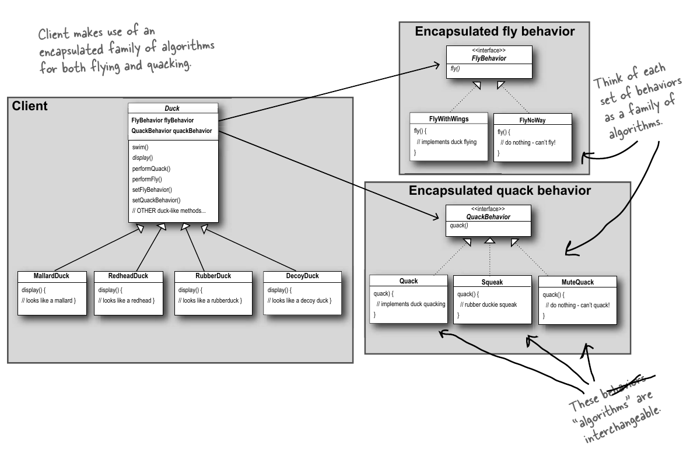

### 1. Introduction to design patterns (Strategy Pattern)

* Localised update to code causes non-local side effects. (Adding fly feature to duck superclass causes all subclasses to inherit the fly method from baseclass and perform the fly action)
* One way to avoid these non-local side effects is to create interfaces for actions that are not going to be used in every sub-class(example Fly[all ducks are not supposed to fly]). And only the classes that need those interfaces can implement them.
* However, having interfaces solves the problem but it does introduce lots of code maintainence issues. Assume you have a single interface that needs a restructure and if this interface is being implemented by more than 100 classes; everyone needs a restructure.
* Finding a way to build software so that when there are incremental changes we can do the change without impacting existing codebase. No matter how well you design an application, over time an application must grow and change or it will die. 
* To prevent using interfaces and impacting an existing codebase; we can use the design principle - **Identify aspects of application that vary and separate them from what stays the same**. In other words - **Take what varies and “encapsulate” it so it won’t affect the rest of your code**
* Here’s another way to think about this principle: take the parts that vary and encapsulate them, so that later you can alter or extend the parts that vary without affecting those that don’t.
* In the duck example we can figure out that the duck class works well and it doesnt change frequently. The parts that change are **duck** and **quack**. So, we create two separate classes for each respectively. Each set of classes will hold all implementations of respective behavior.
* To separate out the changing flying and quacking behaviors we use the second design principle - **Program to an interface, not an implementation**
* Program to implementation - 
  * `Dog d = new Dog(); d.bark();` - where `Dog` and `Cat` are subclasses of superclass `Animal`
* Program to interface - 
  * `Animal a = new Dog(); a.makeSound();` -  where `Dog` and `Cat` are subclasses of superclass `Animal` 
* In the above examples, when we program to interface, we know its a dog but we can use the animal reference polymorphically. However, in case of program to implementation, declaring the reference as Dog of type D forces us to code a concrete implementation.
* We’ll use an interface to represent each behavior—for instance, FlyBehavior and QuackBehavior—and each implementation of a behavior will implement one of those interfaces.  Duck classes that will implement the flying and quacking interfaces. Instead, we’ll make a set of classes whose entire reason for living is to represent a behavior (for example, “squeaking”), and it’s the behavior class,rather than the Duck class, that will implement the behavior interface. 
* **“Program to an interface” really means “Program to a supertype.”** The word interface is overloaded. This sentence simply tells to exploit polymorphism by programming to supertype so that the actual runtime object isn't locked during execution.
* Program to supertype can be repharsed as - **the declared type of the variables should be a supertype, usually an abstract class or interface, so that the objects assigned to those variables can be of any concrete implementation of the supertype, which means the class declaring them doesn’t have to know about the actual object types!**
* Using abstract class as supertype is not a good practice as it will lead to problems in inheritance chain. If two child classes have to talk to each other, we require multiple inheritance which is bad. And inheritance in general is bad. 
* Delegating the flying and quacking behavior from Duck to the respective Behavior interfaces.
  1. Add instance variables of respective behavior interfaces in the Duck class
  2. Add functions that allow the Duck to `performFly()` and `performQuack()`
* We can set the dynamic duck behavior type by using a setter method in the Duck class rather than instantiating it in duck constructor.
* The HAS-A relationship is an interesting one: each duck has a FlyBehavior and a QuackBehavior to which it delegates flying and quacking.  When two classes are used together like this it indicates that we are using composition. Instead of inheriting their behavior, the ducks get their behavior by being composed with the right behavior object. This is an important technique; in fact, it is the basis of design principle: **favor composition over inheritance**.
* Not only does it encapsulate a family of algorithms into their own set of classes, but it also changes behavior at runtime as long as the object that are being composed with implements the correct behavior interface. 
* **The Strategy Pattern defines a family of algorithms, encapsulates each one, and makes them interchangeable. Strategy lets the algorithm vary independently from clients that**
* A very simple strategy pattern example can be like you have a family of sorting and searching algorithms. Different data structures like - lists, sets, dictionaries will use these families of sorting and searching behavior on the basis of which suits them the best.
* **Summary:**
  1. Identify aspects of application that vary and separate them from what stays the same. 
  2. Program to interface, not an implementation.
  3. Favor composition over inheritance.
  4. Strategy pattern - family of algorithms, encapsulating each one and making them interchangeable. 

* **Code:**
  * [Duck simulator](../codefiles/strategy/SimuDuck)

* **Class Diagram** - 
  
