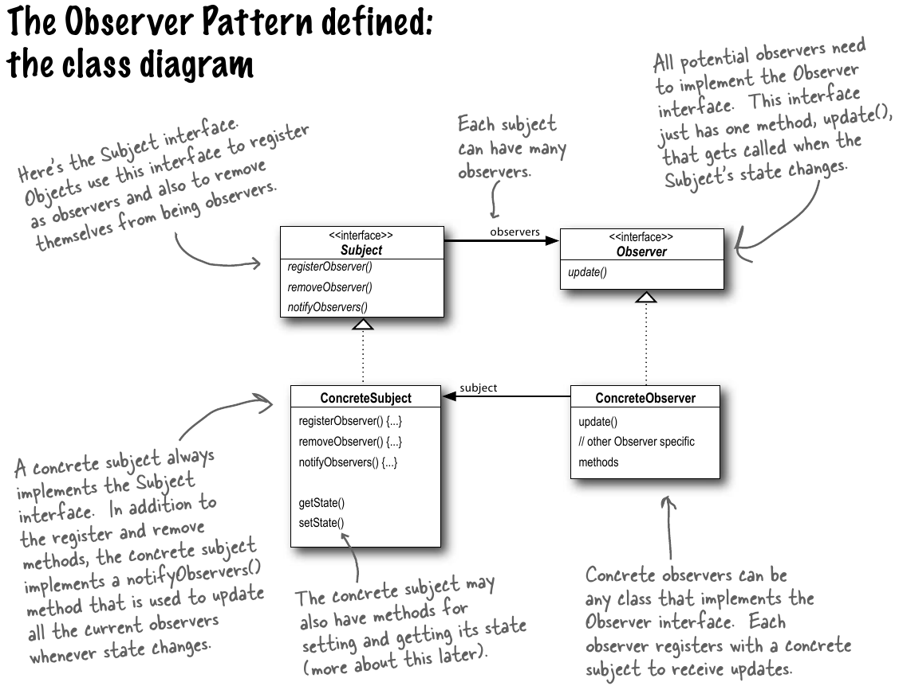
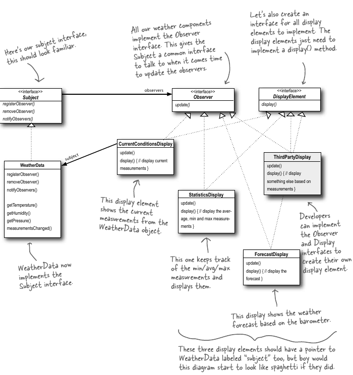
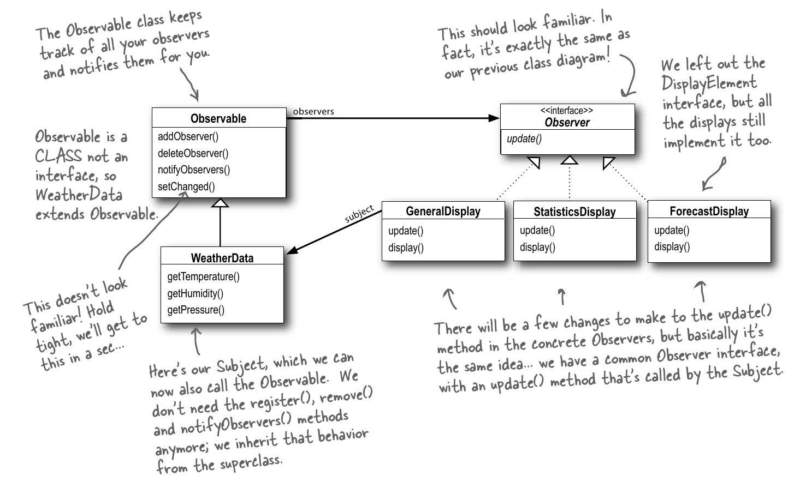

### 2. Keeping your objects in the know (Observer Pattern)

* The task is to build a Internet Based Weather Monitoring Station (Weather-O-Rama). Three key components in the System are `Weather Station`, `WeatherData Object` and `Display Device`.
* WeatherData class has getters(getTemperature(), getHumidity(), getPressure()) for 3 measurement values respectively. When we have a new measurement data, measurementsChanged() gets executed. 
* **Publishers(Subjects) + Subscribers(Observers) = Observer Pattern**
* Subject object manages some bit of data. If the data in the subject changes, the observers or subscribers to the data get notified.
* Newspaper subscription service is a good exaple of Observer Pattern
* **The observer pattern defines a one-to-many dependency(relationship) between objects so that when and if one object changes state, all its dependents are notified and updated automatically.**
* **Loose Coupling** - If two objects are loosely coupled they can intersect but they have very little knowledge about each other.
* Observer pattern adheres to the concept of loose coupling. How?
  1. The only thing subject knows about observer is that it implemnents certain interface.
  2. We can add new observers anytime.
  3. No need to modify subject while adding new observers.
  4. We can reuse subjects / observers independently of each other.
  5. Changes to either of subject / observer will not affect each other. 
* **Strive for loosely coupled designs between objects that interact.**
* *Loosely coupled designs allow us to build flexible systems that can handle change because they minimize interdependency between subjects.*
* We can also implement the above pattern using Java's in-built Observer pattern API. In this new implementation, the Subject(WeatherData) extends the Observable Class(instead of implementing an interface) and inherits the add, delete and notify Observer methods.
* To incorporate using java's builtin API changes - 
  * For object to become observer, call `addObserver()` on any observable object. Similarly to remove observer, call `removeObserver()`.
  * For observable to send notifications, extend java's Observable superclass which makes you observable. Call `setChanged()` to signify that the state has changed in the object. Call either `notifyObservers()` or `notifyObservers(Object obj)`
  * For an observer to recieve notifications, implement the update method with args as Observable Subject(the subject that has changed) and Object(the object that has to receive changed measurements).
  * The changes in measurement have to be propagated to respective observers either by using a pull based or a push based mechanism. In eit her mechanisms, we need to figure out a way if the state of the measurements have changed or not. Thus we use,`setChanged()`, `hasChanged()` and `clearChanged()` methods to support the change functionality.
  * Refer the [class diagram](../assets/ObserverPatternJavaBuiltIn.png) for better understanding on the Observable API design. 

* **Summary: (pending)**
  1. When to use Observer Pattern? => When many objects receive an update if there is a change in one of the subjects.
  2. Strive for loosely coupled designs between objects that interact.
  3. Publishers(Subjects) + Subscribers(Observers) = Observer Pattern.

* **Code:**
  * [Weather application simulator](../codefiles/observer/WeatherApplicationSimulator/)
  * [Weather application simulator v2](../codefiles/observer/WeatherApplicationSimulatorV2/)

* **Class Diagrams** -   
   1. Generic Observer pattern -   

      
  
  2. Weather Station Simulator Class Diagram - 

      
  
  3. Weather Station Simulator Class Diagram with Java Observable API -

      
