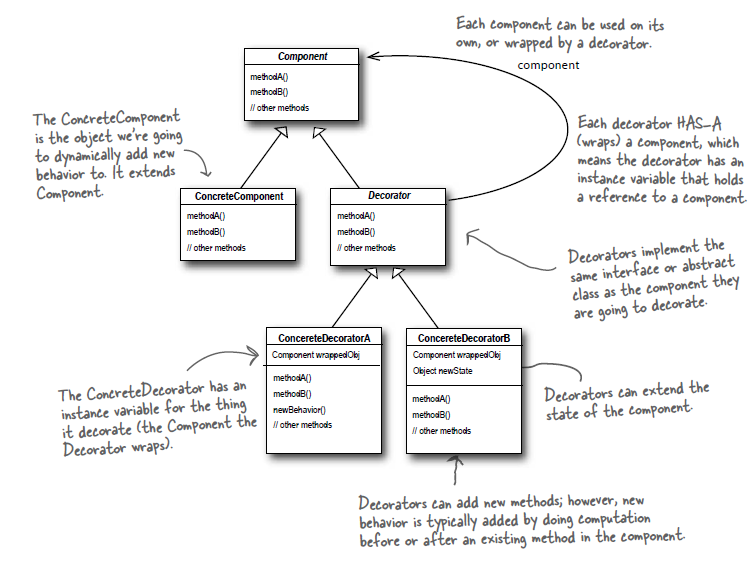
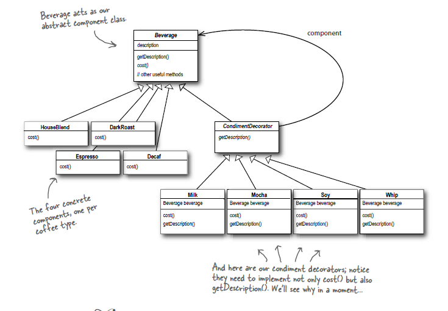

### 3. Decorating Objects (Decorator Pattern)

* Inhertiance relies on the idea of subclassing. But creating too many subclasses leads to class explosion.
* The Starbuzz Coffee example has `Beverage` as the base class with different variants of beverages like `Houseblend`, `Darkroast`, `Decaf` and `Espresso`. These variants are inherited from the base class as child classes. These inherited subclasses implement the `cost` method to return the cost of beverage.
* Lets say if the Starbuzz coffee shop needs to expand their menu items and add several condiments. So now along with different flavours we have different condiments that inherit the base class Beverage for their respective cost and description.
* Class explosion leads to maintenance nightmare. One approach to prevent this is using instance variables and inheritance in superclass to keep track of condiments. But by doing this we are modifying the behavior and the responsibility of the abstract base class `Beverage`.
* Inheritance doesn't always lead to flexible or maintainable design. Inheritance can be achieved at runtime using composition and delegation.
* Subclassing a class is a behavior achieved statically during compile time. Also by doing this, all subclasses must inherit the same behavior. However, we can extend the object's behavior during runtime using composition.
* **Effect of composition on code maintainence - By dynamically composing objects we can add new functionality by writing new code rather than altering exisiting code.**
* **Open Closed Principle: Classes must be must be open for extension, closed for modification.**
* Decorator pattern is based on open closed principle. To implement decorator pattern in the Starbuzz usecase, we take a base-class object like `DarkRoast`. Now we decorate it with additional condiments like `Mocha` and `Whip`. We call the cost method and rely on delegation to add condiment costs over the base `DarkRoast` cost.
* Decorator pattern basically wraps base-class objects with additional features. Decorators have same supertype as the objects they decorate. We can pass around a decorated object in place of original wrapped object.
* Decorators add their own behavior either before or after delegating to the object it decorates to do the rest of job.
* **The Decorator Pattern attaches additional responsibilities to an object dynamically. Decorators provide a flexible alternative to subclassing for extending functionality.**
* From the class diagram, we create a subclass `Decorator` of abstract class `Component`. This `Decorator` class acts as HAS-A and IS-A relation to `Component` at the same time. We initialize the Concrete Component subclass and pass it to Concrete Decorator.  We wrap components within decorators.
* When we compose a decorator with a component, we are adding new behavior. We are acquiring new behavior not by inheriting it from a superclass, but by composing objects together. We subclass the base class to get the correct type but not to inherit its behavior. Behavior comes from composition of decorators with the base components and other decorators.
* If we have code that relies on concrete component's type then decorators will break that piece of code. As long as we write code against abstract component type the use of decorators will reamin transparent to the code.
* Real world decorators : Java IO. 
To read a text file we use `FileInputStream` which is the base component to be decorated. We wrap this with `BufferedInputStream` which is a concrete decorator. It adds behavior in 2 ways - It improves performance and also augments interface with a method `readLine()` for reading character based inputs. Now we wrap this with `LineNumberInputStream` as it adds the ability to count line numbers as it reads data.

* **Class Diagrams** -
  1. Generic Decorator Pattern - 

        

  2. Decorator Pattern for Starbuzz Coffee - 

        
        