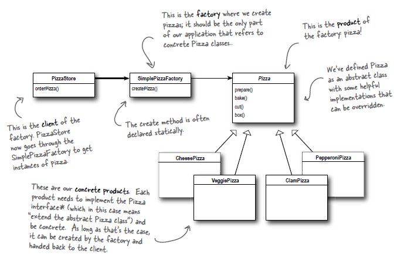
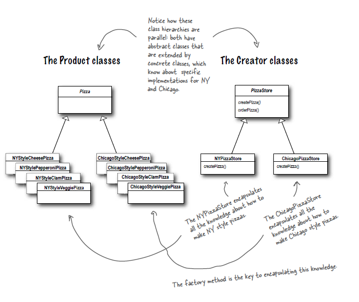
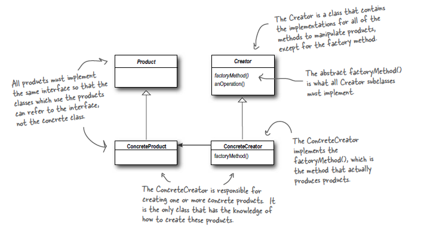
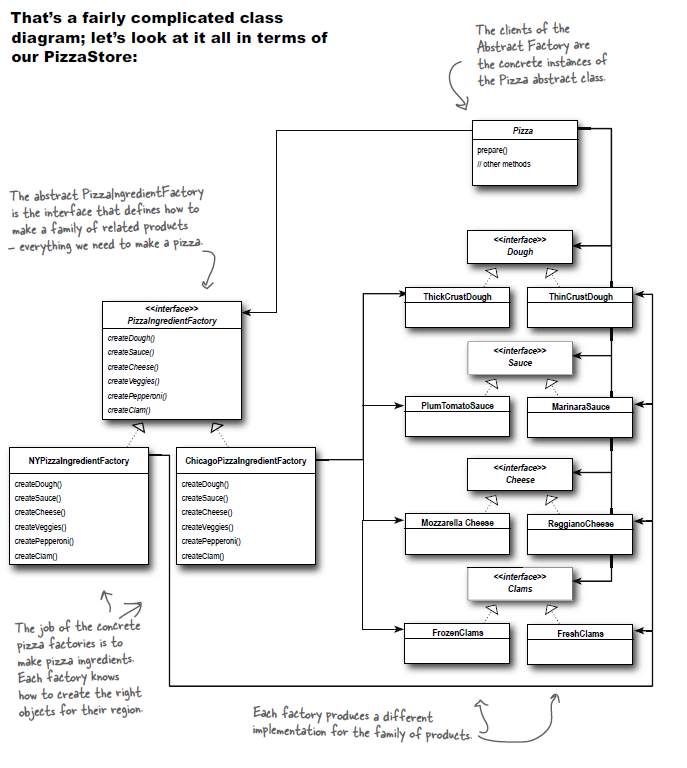
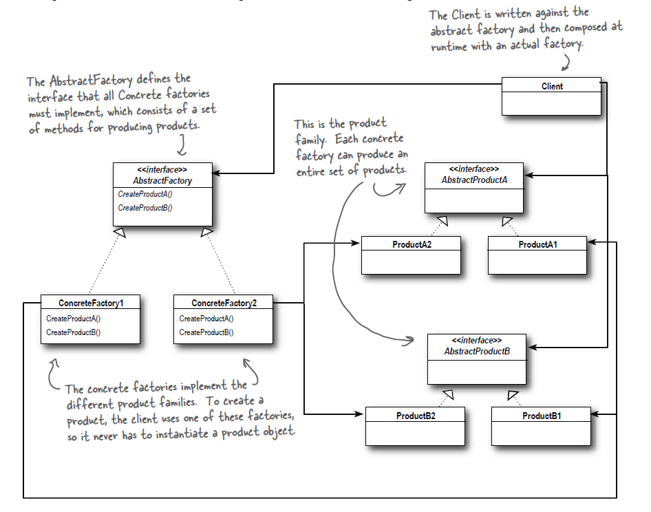

## Baking with OO Goodness (Factory Pattern & Abstract Factory Pattern)

* When we use `new` keyword, we are instantiating a concrete class so this is definitely an implementation, not an interface. There is nothing wrong with the keyword `new`. The real culprit is change and how change impacts the use of `new`.
* If we have a set of concrete classes, we are forced to design the logic of our application in the following manner - 

    ```
    Duck duck;
    if (picnic) {
        duck = new MallardDuck();
    } else if (hunting) {       
        duck = new DecoyDuck();
    } else if (inBathTub) {
        duck = new RubberDuck();
    }   
    ```
* The code above is more fragile, error-prone, and not flexible. Also it clearly shows that when it comes time for extension or changes, we will have to revisit this code and examine what needs to be added / deleted.
* By coding to interface, we can insulate ourselves from changes that happen to the system. If the code is written to an interface, it will work with any new classes implementing those interfaces via polymorphism.
* When we have concrete classes, the code is not "closed for modification" which violates the open close principle.
* For the pizza shop, we have an orderPizza method that looks like this - 
    ```
    //based on the type of pizza, we instantiate correct concrete class

    Pizza orderPizza(String type) {
        Pizza pizza;
        if (type.equals(“cheese”)) {
            pizza = new CheesePizza();
        } else if (type.equals(“greek”) {
            pizza = new GreekPizza();
        } else if (type.equals(“pepperoni”) {
            pizza = new PepperoniPizza();
        }
        pizza.prepare();
        pizza.bake();
        pizza.cut();
        pizza.box();
        return pizza;
    }
    ```
* If you need to add more pizza types like a clam pizza or a veggie pizza, you need to modify the above function. Also incase if you want to delete a pizza, you have to modify it.
* Clearly, dealing with which concrete class is instantiated is really messing up our orderPizza() method and preventing it from being closed for modification. We can figure out that the object creationg code is somethign that is varying. This part needs to be encapsulated.
* **The pizza object creation code can be moved into another object that is only responsible / concerned with creating pizzas. This object is called Factory.**
* Creating a SimplePizzaFactory results in following changes -
    ```
    public class SimplePizzaFactory {
        public Pizza createPizza(String type) {
            Pizza pizza = null;
            if (type.equals(“cheese”)) {
                pizza = new CheesePizza();
            } else if (type.equals(“pepperoni”)) {
                pizza = new PepperoniPizza();
            } else if (type.equals(“clam”)) {
                pizza = new ClamPizza();
            } else if (type.equals(“veggie”)) {
                pizza = new VeggiePizza();
            }
            return pizza;
        }
    }

    //client code
    public class PizzaStore {
        
        SimplePizzaFactory factory;
        
        //using a constructor to store the reference of SimplePizzaFactory object.
        public PizzaStore(SimplePizzaFactory factory) {
            this.factory = factory;
        }
        public Pizza orderPizza(String type) {
            Pizza pizza;

            //delegating concrete object creation responsibility to another function
            pizza = factory.createPizza(type); // New is replaced with a createPizza()
            pizza.prepare();
            pizza.bake();
            pizza.cut();
            pizza.box();
            return pizza;
        }
    // other methods here
    }
    ```
* The advantage of pushing code to another object is that when some other classes like(PizzaShopMenu / HomeDelivery) uses the PizzaFactory class to get different types of pizzas; we are encapsulating the pizza creation logic in one class. 
* We can also have a static SimpleFactoryPizza which allows us to avoid the need of instantiating an object to make use of create method. But this also has a disadvatange that we can't subclass and change behavior of create method.
* **SimpleFactory is not a design pattern; its more of a programming idiom**.
* If the pizza store becomes really popular; we might want to create franchise of our store. What if the different franchise are located in different locations and depending on the location; they might want to offer different kinds of Pizza. Example - NYPizzaFactory and ChicagoPizzaFactory.
* One approach is we can create different factories based on the location and then we can compose the PizzaStore with appropriate factory and the franchise is good to go. For example -
    ```
    NYPizzaFactory nyFactory = new NYPizzaFactory();
    PizzaStore nyStore = new PizzaStore(nyFactory);
    nyStore.order(“Veggie”);
    ```
* However, this creates lot of less interdependency between the store and factory. We need more quality control and interdependency between both the things. So we design a framework to localize all pizza making activities to PizzaStore yet we give franchises the freedom to have their own regionall style.
    ```
    public abstract class PizzaStore {
        public Pizza orderPizza(String type) {
            Pizza pizza;
            pizza = createPizza(type);
            pizza.prepare();
            pizza.bake();
            pizza.cut();
            pizza.box();
            return pizza;
        }
        abstract Pizza createPizza(String type); 
    }
    ```
* This ensures that each subclass will have to inherit the createPizza() responsibility; thereby delegating the task of pizza creation(of different types) to sub-classes, yet obeying the PizzaStore class framework. So now, we have this -

    ```
    public class NYPizzaStore extends PizzaStore {
        Pizza createPizza(String item) {
            if (item.equals(“cheese”)) {
            return new NYStyleCheesePizza();
            } else if (item.equals(“veggie”)) {
            return new NYStyleVeggiePizza();
            } else if (item.equals(“clam”)) {
            return new NYStyleClamPizza();
            } else if (item.equals(“pepperoni”)) {
            return new NYStylePepperoniPizza();
            } else return null;
        }
    }
    ```

* *abstract Product factoryMethod(String type)* - This is the factory method that handles object creation and encapsulates it in a subclass. It decouples client code in superclass from object creation code in subclass.
* **The Factory Method Pattern encapsulates object creation by letting subclasses decide what objects to create.**
*  It gives us a way to encapsulate instantations oif concrete types. 
* **Definition: The Factory Method Pattern defines an interface for creating an object, but lets subclasses decide which class to instantiate. Factory Method lets a class defer instantiation to subclasse** 
* In the class diagram of Factory pattern given below, the abstract Creator gives an interface with a method for creating objects known as the factory method. Any other methods written in the abstract creator are written to operate on products produced by the factory method. Only subclass actually implement the factory method and create products.The creator class doesn't have an idea about the actual products that will be created; this is decided purely by the choice of subclass that is being used. 
* Advantages -
    * Decoupling object creation logic in separate factories results in less code duplication and provides a single place for code maintainence.
    * Client relies only on the interfaces rather than concrete classes which correlates with the design principle - *'Program to interface, not an implementation'* 
* **Dependency inversion principle - Depend on abstractions. Do not depend upon concrete classes.**
* Dependency inversion principle make strong statement about abstraction. It suggests that the high-level components should not depend on the low-level components. And, both components should depend upon abstractions.
* The `inversion` in the dependency inversion principle - The low-level component depend on high level abstraction. And the high-level component is also tied up with the abstraction. Thus, the top-to-bottom dependency is inverted with both high-level and low-level modules depending on abstraction.
* Guidelines for achieving dependency inversion principle in the OO Design -
    * No variable should hold a reference to concrete class. (If we use new, we hold a reference; instead of that use a factory)
    * No class should be derived from concrete class. (If we derive from concrete class we have a dependency on it. Derive from an abstraction.)
    * No method should override an implemented method of any of its classes. (If we override an implemented method than the base class isn't really an abstraction.)

----

* In the earlier design we don't really need two classes for two pizzas. We can have a factory called ingredient factory that can handle the regional difference of Pizzas. The pizza class doesnt care about anything else other than making pizza. So, we have delegated the responsibility of adding ingredients over the pizza to the ingredient factory class.
    ```
    public class CheesePizza extends Pizza {
    
        PizzaIngredientFactory ingredientFactory;
        
        public CheesePizza(PizzaIngredientFactory ingredientFactory) {
            this.ingredientFactory = ingredientFactory;
        }
        void prepare() {
            System.out.println(“Preparing “ + name);
            //the ingredient factory can be anything (depending on the region).
            dough = ingredientFactory.createDough();
            sauce = ingredientFactory.createSauce(); //here we are setting the pizza instance to refer specific pizza sauce
            cheese = ingredientFactory.createCheese();
        }
    }
    ```
* Here, what we have done is provided a means of creating a family of ingredients(dough, sauce, cheese, veggie, etc.) for pizzas. This kind of factory is called as - Abstract Factory.
* We go down the rabbit hole of decoupling with abstract factory pattern. Abstract Factory gives an interface for creating family of products. Once we implement these interfaces, we decouple our code from actual factory that creates product. 
* Complete order process with Abstract Factory - 
    - PizzaStore nyPizzaStore = new PizzaStore(); //create instance of NYPizzaStore
    - nyPizzaStore.orderPizza("cheese"); //take the pizza order
    - Pizza p = createPizza("cheese"); //orderPizza() in turn calls createPizza()
    - Pizza p = new CheesePizza(nyIngredientFactory); //inside createPizza(), the CheesePizza() is referenced and that's when the nyIngredientFactory is passed to the CheesePizza()
    - void prepare() { dough = factory.createDough(); ... }

* Abstract Factory Pattern - **provides an interface for creating families of related or dependent objects without specifying their concrete classes**
* Abstract Factory allows a client to use an abstract interface to create a set of related products without knowing (or caring) about the concrete products that are actually produced.
* Often the methods of an Abstract Factory are implemented as factory methods. The job of an
Abstract Factory is to define an interface for creating a set of products. Each method in that interface is responsible for creating a concrete product, and we implement a subclass of the Abstract Factory to supply those implementations. So, factory methods are a natural way to implement your product methods in your abstract factories.


* **Class Diagrams** -
  1. SimpleFactory idiom - 

        

  2. Classes in Factory Pattern -

        

        

  3. Generic Factory Pattern -

        

  4. Scenario in Abstract Factory Pattern -
        
        

  5. Generic Abstract Factory Pattern -
        
        

