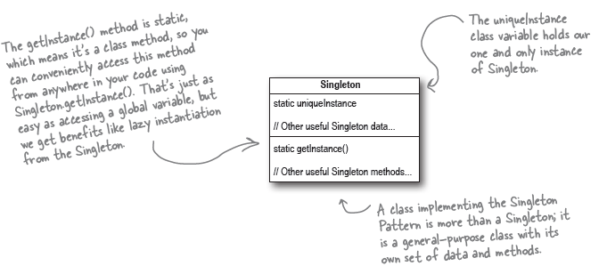

## One-of-a-kind objects (Singleton Pattern)

* There are many kinds of objects for which we only need one of - thread pools, caches, dialog boxes, objects that handle preferences and registry settings. If we have multiple instances of such objects we are going to run into incorrect program behavior.
* Lets backtrack. *How do we avoid creating multiple instances of a single class?* 
    ```
        public MyClass {
            private MyClass() {}
        }
    ```
    * The code below is not accessible to any of the instances of the class. It is only accessible to all the functions within the class.
    * The code above is a classic *chicken-egg problem* where, we can use the constructor from object of type `MyClass` but we can never instantiate the object because no other object can use `new MyClass()`
* If we define a static method inside `MyClass` we can access it outside directly without the need of any object. And if we put things together - 
    ```
        public MyClass {
            private MyClass() {}

            public static getInstance() 
        }
    
    ```
* To ensure that we create just one single instance, lets add a couple of more lines -
    ```
        public class Singleton {
            private static Singleton uniqueInstance; //static variable to hold one of the instance of the class.
            private Singleton() {} //declaring the constructor private so only Singleton can instantiate this class.
            
            public static Singleton getInstance() { // allows creating single instance of class
                if (uniqueInstance == null) {
                    uniqueInstance = new Singleton();
                }
                return uniqueInstance;
            }
        }
    ```
* **The Singleton Pattern ensures a class has only one instance, and provides a global point of access to it.**

* The code above doesn't work well in a multi-threaded environment when two threads try to access the `getInstance()` at same point in time. To overcome this we can add a syncrhonization primitive to our `getInstance()` method. 
* This allows the other threads to wait and one one thread is allowed access to the getInstance() at any point in time.
* But, using synchronization everytime when a thread wants a single instance is highly unnecessary and an expensive operation.
* Once we get an instance of Singleton, we really need not synchronize this method after the first time. 
* If the performance of application is critical we can do a couple of changes - 
    * change the lazy instantiation to eager instantiation.
    * use "double-check locking"

* **Class Diagrams** -
  1. Singleton Pattern - 

        


